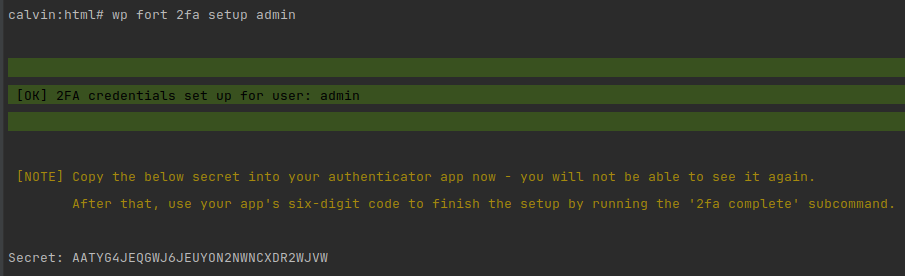
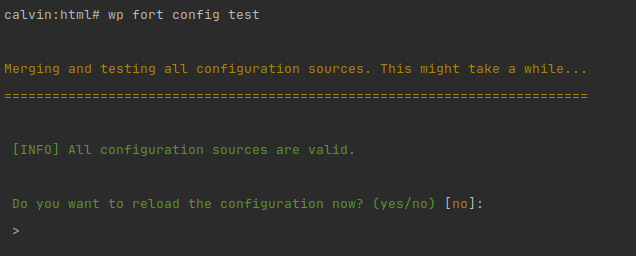
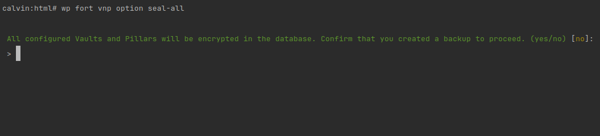
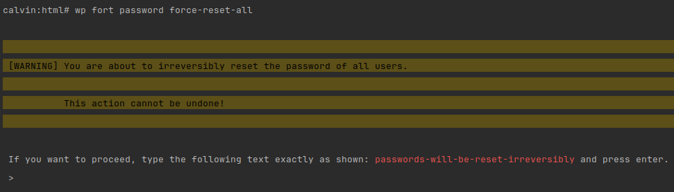

# Fortress CLI

<!-- TOC -->
  * [Introduction](#introduction)
  * [General principles](#general-principles)
    * [Writing to `STDOUT` vs `STDERR`](#writing-to-stdout-vs-stderr)
    * [Exit codes](#exit-codes)
    * [Error handling](#error-handling)
    * [Controlling output verbosity](#controlling-output-verbosity)
    * [Color support](#color-support)
    * [Interactivity](#interactivity)
      * [Optional confirmations](#optional-confirmations)
      * [Confirm proceeding](#confirm-proceeding)
      * [Acknowledgement](#acknowledgement)
  * [Backwards compatibility guarantees](#backwards-compatibility-guarantees)
  * [Command reference](#command-reference)
    * [version](#version)
    * [setup](#setup)
    * [config cache clear](#config-cache-clear)
    * [config cache ls](#config-cache-ls)
    * [config ls](#config-ls)
    * [config optimize](#config-optimize)
    * [config test](#config-test)
    * [config update](#config-update)
    * [2fa setup](#2fa-setup)
    * [2fa complete](#2fa-complete)
    * [2fa delete](#2fa-delete)
    * [2fa reset-attempts](#2fa-reset-attempts)
    * [2fa reset-recovery-codes](#2fa-reset-recovery-codes)
    * [magic-link create](#magic-link-create)
    * [password force-reset-all](#password-force-reset-all)
    * [password reset](#password-reset)
    * [password upgrade-legacy-hashes](#password-upgrade-legacy-hashes)
    * [session destroy-all](#session-destroy-all)
    * [session gc](#session-gc)
    * [session toggle-sudo](#session-toggle-sudo)
    * [vnp option purge-cache](#vnp-option-purge-cache)
    * [vnp option seal-all](#vnp-option-seal-all)
    * [vnp option unseal-all](#vnp-option-unseal-all)
<!-- TOC -->

## Introduction

Fortress is built with a CLI-first approach to allow maximum automation
in appliance distribution.

The Fortress CLI is the central "interface" to Fortress, built with absolute focus on quality and reliability
that matches the [standards of critical infrastructure tools](https://clig.dev).

- Thousands of integration and end-to-end tests ensure that the CLI works as expected.
- Strict backwards compatibility guarantees for automated scripts.
- Full feature parity between the Web UI and the CLI, with the CLI offering even more functionality.

Although the Fortress CLI is largely an independent application, it is integrated into the WP-CLI runner using our
open-source [`BetterWPCLI`](https://github.com/snicco/better-wp-cli) library.
This eliminates the need for a separate dependency to be installed on the server.

## General principles

### Writing to `STDOUT` vs `STDERR`

The following rules are valid without exception, and every deviance will be considered a bug:

- `STDOUT` only contains the primary output of a command that might be piped into a different command. 
  If a command has no output that might be piped, it writes nothing to `STDOUT`.
- **Everything** else is written to `STDERR`, including all diagnostic output, messages for the user running the command,
  and progress information.

Let's illustrate this using the [`2fa setup` command](#2fa-setup):

By default, a user that runs the command in a Terminal will see the following:

```shell
wp fort 2fa setup admin
```

By default, a user running the command from the terminal will see the following:

|  |
|-------------------------------------------------------|

All the colored "user feedback" is written to `STDERR`.

`STDOUT` contains: <br>
`Secret: A4YSBRJXNP2DF3K3K2Q3WDBSSRISIFLV`.

Since both `STDOUT` and `STDERR` write to the terminal by default, the user sees both outputs.

Re-running the command and sending `STDERR` to `/dev/null` results in:

```console
$ wp fort 2fa setup admin 2>/dev/null

Secret: F33QKUR5TZDAU4HQVDIV4FA3JN7YAOPW
```

No progress information clutters the output, which allows piping the output into another command or file.

If STDOUT is redirected, a terminal user will only the progress information/feedback.

```console
$ wp fort 2fa setup username | sed 's/Secret: //' > secret.txt

 [OK] 2FA credentials set up for user: admin                                                                                                                                                                                        
                                                                                                                                                                                                                                    

 [NOTE] Copy the below secret into your authenticator app now - you will not be able to see it again.                                                                                                                               
        After that, use your app's six-digit code to finish the setup by running the '2fa complete' subcommand.
```

Again, the output streams are cleanly separated, without sacrificing the
user experience.

The piped STDOUT only contained the secret, which was written to `secret.txt`.

```console
$ cat secret.txt 
22XNIGYBK3PCHXC5WNQQHTQVF4KY6F5Y
```

### Exit codes

Fortress CLI will exit with `0` on success, 
and a non-zero exit code on failure.

Any deviation from this behavior is considered a bug.

### Error handling

Fortress's CLI commands have very robust error
handling.
[Read more here](../debugging-and-more/error-handling.md#fortress-cli-commands).

### Controlling output verbosity

Fortress CLI has a concept of verbosity levels to allow the
user to choose how detailed the command output should be.

Each command supports the following flags:

- `--quiet` - Print nothing to `STDERR` expect the main error that causes a command to fail.
  <br>Note:
  Using `--quiet` will automatically mark a command as [non-interactive](#interactivity)
  since no confirmation prompts will be displayed.
- `--v`: Verbose output.
- `--vv`: Very verbose output.
- `--vvv`: Debugging.

Only `STDERR` output is affected by the verbosity level.

`STDOUT` is always the same, regardless of the verbosity level.

The output verbosity also controls the level of detail of Fortress's exception messages.
<br>(Note, the `auth totp:setup` command is now called `2fa setup`)

|                 Default verbosity.<br><br>                 |
|:-----------------------------------------------------------------------------------------------------------------:|
|      **Running with verbose output**<br><br>       |
| **Running with very verbose output**.<br><br> |

--- 

### Color support

Fortress detects if the current environment supports ANSI colors for both `STDOUT` and `STDERR` individually.
Typically, this works without any intervention or configuration.

- `STDOUT` never contains coloring if it's redirected.
- `STDERR` never contains coloring, even if it's redirected.

However, you can explicitly set the behavior using the `--ansi` or `-no-ansi` flag.

```shell
wp fort 2fa setup admin --no-ansi
```

Every Fortress CLI command supports the `--ansi` / `--no-ansi` flag.

### Interactivity

Some commands interactively prompt for input or confirmation.

However, interactivity is never required. 
Alternative options/flags are always available to bypass the interactive prompts,
so that commands don't block automated scripts.

**Each interactive confirmation always has a one to one mapping to a flag that can be passed to the command.**

Some commands even **require confirmation with flags for automated scripts**.

Interactivity is determined by checking if `STDIN` is a Terminal/TTY.

This works as expected in almost all cases, but the automatic detection
of interactivity can always be overwritten by either passing:

- `--interaction` - to force interactivity.
- `--no-interaction` - to force non-interactivity.

Another use case of the `--no-interaction` flag is simulating
how commands would behave if they were run in an automated scripts, for example,
in a CI/CD pipeline, or a bash script that runs over SSH.

There are three different types of interactive prompts:

#### Optional confirmations

An optional confirmation is a prompt that asks the
user to confirm an optional action that is not
destructive, nor required for the command to "make sense."

An optional confirmation can always be omitted in automated
scripts.

A good example of this is the [`config test` command](#config-test).

If all configuration sources are valid, a user
is asked if they want to reload the [configuration cache](../configuration/01_how_to_configure_fortress.md).

|  |
|-----------------------------------------------------------------------------------------|

If the command is run in a non-TTY environment, there are two options:

- Either, the `--reload-on-success` flag is passed, which acts as a `"yes`" answer.
- Or, the command assumes the default answer `"no"` which in this case means, "just test the configuration, but don't reload anything."

#### Confirm proceeding

Some commands require a confirmation before starting.
This is done to prevent accidentally running destructive actions.

An example of this is the [`vnp option seal-all` command](#vnp-option-seal-all).

A terminal user will be asked to confirm that they created a
backup of the database before proceeding.

|  |
|-----------------------------------------------------------------|

If the command is run in a non-TTY environment, there are two possible outcomes:

- Either, the `--force` flag is passed, which acts as a `"yes`" answer.
- Or, the command fails, because a required flag was not passed.

```console
$ wp fort vnp option seal-all --no-interaction

[ERROR] Running the 'vnp option seal-all' command in an automated scripts requires the '--force' flag to be passed explicitly
```

All commands that need to be confirmed implement this behavior with a `--force` flag.

#### Acknowledgement

Some commands are irreversible (other than restoring a backup).

An example of this is the [`password force-reset-all` command](#password-force-reset-all).

A terminal user will need to type a special confirmation message to proceed.

|  |
|-----------------------------------------------------------------|

The acknowledgment message is different for each command to prevent
copy-paste errors.

If the `password force-reset-all` command is run in an automated script, there are two outcomes:

- Either, the `--ack=passwords-will-be-reset-irreversibly` is passed, which acts as a `"yes`" answer.
- Or, the command errors because the required flag was not passed.

```console
$ wp fort password force-reset-all --no-interaction

[ERROR] The '--ack=<acknowledgment>' option must be passed explicitly when running this command non-interactively.
```

## Backwards compatibility guarantees

All the below elements are covered by backwards compatibility guarantees 
under [Fortress's semantic versioning](../getting-started/02_installation.md#versioning).

- `STDOUT` - Running `wp fort <command> --help` documents the command's STDOUT, and which parts of the output are guaranteed to be stable.
- Zero vs non-zero exit codes.
- Arguments, flags, options, and their behavior.
- Command names and namespaces.
- The number of required flags to run a command in non-TTY mode.

The following elements are not covered by backwards compatibility guarantees:
- `STDERR` - Nothing that a command prints `STDERR` is guaranteed to be stable.
- [Optional confirmations](#optional-confirmations) - New optional confirmations might be added to commands that might add **new optional functionality** for Terminal/TTY users.

## Command reference

- To get a list of all available commands, you can always
  run `wp fort --help`.
- To get examples and documentation for a specific command, you can run `wp fort <command> --help`.

Note, some commands are only available if the corresponding Fortress
module has not been disabled.

- `2fa <subcommand>` ("auth" module)
- `magic-link <subcommand>` ("auth" module)
- `password <subcommand>` ("password" module)
- `session <subcommand>` ("session" module")
- `vnp <subcommand>` ("vaults and pillars" module)

In the online reference, all default command options are omitted, but all commands 
have the below options/flags:

- `--v`, `--vv`, `--vvv` options for [output verbosity](#controlling-output-verbosity).
- `--ansi/--no-ansi` option for [color support](#color-support).
- `--interaction/--no-interaction` option for [interactivity](#interactivity).

### version

```log
NAME

  wp fort version

DESCRIPTION

  Outputs information about the Fortress version

SYNOPSIS

  wp fort version [--format=<format>]

OPTIONS

  [--format=<format>]
    Controls the output format of the version information
    ---
    default: plain
    options:
      - plain
      - json
    ---

EXAMPLES 

  # Output the version information as human readable text.
  $ wp fort version
  ---
  Version: 1.0.0-beta.38
  Commit: 2830e3570e276e3214f61285d0b45f48fda3c0a2
  ---

  # Output the version information as JSON.
  $ wp fort version --format=json
  ---
  {
    "version": "1.0.0-beta.38",
    "commit": "2830e3570e276e3214f61285d0b45f48fda3c0a2"
  }
  ---

  # Output the version information and pipe it into 'jq' for further processing
  $ wp fort version --format=json | jq .commit
  ---
  "2830e3570e276e3214f61285d0b45f48fda3c0a2"
  ---

  # Display 'raw' strings without JSON quotes
  $ wp fort version --format=json | jq -r .commit
  ---
  2830e3570e276e3214f61285d0b45f48fda3c0a2
  ---

MANUAL 

  Outputs information about the current version of Fortress that is installed.

  The STDOUT ouf this command has the structure:

  ---
  Key1: value1
  Key2: value2
  ---

  Currently it outputs the following keys:

  ---
  Version: <version>
  Commit: <commit_hash>
  ---

  New keys may be added to the output in future versions of Fortress without being considered a breaking change.
  However, existing keys will not be removed.
  The order of keys may also change in future versions.
```

### setup

```log
NAME

  wp fort setup

DESCRIPTION

  Perform Fortress setup tasks

SYNOPSIS

  wp fort setup

MANUAL 

  Performs all necessary setup tasks for a Fortress version such as creating database tables.

  Run this command after installing Fortress and after updating to a new version of Fortress.

  If no updates are needed, the command will not make any changes.

  This command is idempotent and can be safely run multiple times without adverse effects, even after partial failures.

  This command has no STDOUT and only prints errors to STDERR (if any).
```

### config cache clear

```log
NAME

  wp fort config cache clear

DESCRIPTION

  Clear the configuration cache of Fortress.

SYNOPSIS

  wp fort config cache clear [--force]

OPTIONS

  [--force]
    Skip the confirmation prompt. Required for non-TTY scripts.

MANUAL 

  THIS COMMAND IS DESTRUCTIVE AND SHOULD BE USED WITH CAUTION.

  It clears the entire Fortress configuration cache without
  any validation of the current configuration sources.
  On the next request, Fortress will attempt to rebuild the
  cache.

  If you clear the configuration cache without validating
  that your configuration sources are correct, you might
  break your site.

  The --force flag is required to run this command
  automated environments.

  In almost all cases, you should 'config test --reload-on-success' instead.
  Refer to the documentation for more information:
  https://github.com/snicco/fortress/blob/beta/docs/configuration/01_how_to_configure_fortress.md

  This command has no STDOUT. It only prints errors to STDERR (if any).
```

### config cache ls

```log
NAME

  wp fort config cache ls

DESCRIPTION

  Display the currently cached configuration

SYNOPSIS

  wp fort config cache ls [--key=<key>]

OPTIONS

  [--key=<key>]
    Display only a specific Fortress option. Dot notation can be used to display nested configuration values. A "*" will display the entire snicco/framework configuration.
    ---
    default: ""
    ---

EXAMPLES 

  # Display the cached configuration of the CodeFreeze module
  $ wp fort config cache ls --key=code_freeze
  ---
  {
    "enabled": "auto"
  }
  ---

  # Check if CodeFreeze is currently enabled. The output value is a quoted JSON string.
  $ wp fort config cache ls --key=code_freeze.enabled
  ---
  "auto"
  ---

  # Remove JSON quotes from the output by piping to jq
  $ wp fort config cache ls --key=code_freeze.enabled | jq -r
  ---
  auto
  ---

  # Display the entire Fortress configuration and the configuration of snicco/framework - This will produce a large output.
  $ wp fort config cache ls --key=*

  # Display the Vaults&Pillars configuration as 'compact' JSON by piping to jq
  $ wp fort config cache ls --key=vaults_and_pillars | jq -c
  ---
  {"option_pillars":[],"option_vaults":[],"strict_option_vaults_and_pillars":false}
  ---

MANUAL 

  Use this command to display the configuration that is currently
  cached and used by Fortress.

  The cached configuration might be different from what your configuration sources
  currently contain if you did not yet reload the configuration cache.

  The configuration cache is always the single source of truth for
  what is used at runtime.

  The STDOUT of this command is a JSON representation
  of the entire configuration or a subset of it if the --key
  option is used.

  Even if --key=<key> is used to display a single value, it will
  still be JSON encoded.

  The command fails if a --key is pointed at a non-existing configuration option.

  For more information on how the configuration is loaded and cached,
  refer to the documentation at:
  https://github.com/snicco/fortress/blob/beta/docs/configuration/01_how_to_configure_fortress.md
```

### config ls

```log
NAME

  wp fort config ls

DESCRIPTION

  Displays information about all configuration sources

SYNOPSIS

  wp fort config ls [--source=<source>]

OPTIONS

  [--source=<source>]
    Only display a specific configuration source. If passed, the value must be one of the defined configuration sources.

EXAMPLES 

  # STDOUT if no configuration sources are defined
  $ wp fort config ls
  ---
  []
  ---

  # STDOUT for a site with a "site" and a "server" configuration source, but the "server" file has not been created yet
  $ wp fort config ls
  ---
  {
    "server": {
        "name": "server",
        "file_path": "/var/www/path-to-fortress.server.json",
        "file_exists": false
    },
    "site": {
        "name": "site",
        "file_path": "/var/www/path-to-fortress.site.json",
        "file_exists": true,
        "content_decoded": {
            "code_freeze": {
                "enabled": "no"
            }
        }
    }
  }
  ---

  # Only display a "site" configuration source
  $ wp fort config ls --source=site
  ---
  {
    "name": "site",
    "file_path": "/var/www/path-to-fortress.site.json",
    "file_exists": true,
    "content_decoded": {
        "code_freeze": {
            "enabled": "no"
        }
    }
  }
  ---

  # Pipe the output into the jq command to get compact output
  $ wp fort config ls --source=site | jq -c
  ---
  {"name":"site","file_path":"/var/www/path-to-fortress.site.json","file_exists":true,"content_decoded":{"code_freeze":{"enabled":"no"}}}
  ---

  # Output the decoded content of the "site" configuration source
  $ wp fort config ls --source=site | jq .content_decoded
  ---
  {
    "code_freeze": {
        "enabled": "no"
    }
  }
  ---

MANUAL 

   This command displays information about all configuration
   sources that are defined for this site.

   For more information on configuration sources, refer to:
   https://github.com/snicco/fortress/blob/beta/docs/configuration/01_how_to_configure_fortress.md#configuration-sources

   The STDOUT of the command is either an object containing all configuration sources, keyed by their type,
   or a single configuration source if the "--source" option is used.

   The representation of a single configuration source has the following structure:
   {
     "name": "the name of the configuration source",
     "file_path": "absolute path to the configuration source file",
     "file_exists": "true if the file exists - This is determined by calling PHP's is_file() function.",
     "content_decoded": "The decoded content of the configuration source.
                         For PHP config sources, this means JSON encoding the returned array.
                         For JSON config sources, this means decoding the JSON string.
                         "
   }

   Note: The "content_decoded" property is only present if the file exists!

   If there are any errors reading the configuration sources from the filesystem, detailed diagnostic
   output will be displayed to STDERR and the command will return with a non-zero exit code.

   New keys might be added to the STDOUT in the future, but no existing keys will be removed.
``` 

### config optimize

```log
NAME

  wp fort config optimize

DESCRIPTION

  Optimize the "site" configuration source.

SYNOPSIS

  wp fort config optimize [--dry-run] [--reload]

OPTIONS

  [--dry-run]
    Default: false. Pass --dry-run to only print the changes to STDOUT without saving them.

  [--reload]
    Default: true. Pass --no-reload to only save the configuration source, but not reload the configuration cache.

EXAMPLES 

  # Preview optimizations without saving them.
  $ wp fort config optimize --dry-run

  # Optimize the configuration but don't reload the configuration cache
  $ wp fort config optimize --no-reload

  # STDOUT if optimizations are available and the existing configuration source has other keys.
  $ wp fort config optimize
  ---
  {
    "changes": {
        "password": {
            "allow_legacy_hashes": false,
            "disable_application_passwords": true
        }
    },
    "optimized_config": {
        "session": {
            "protected_capabilities": [
                "install_plugins"
            ],
            "protected_pages": [
                "/wp-admin/plugins.php"
            ]
        },
        "password": {
            "allow_legacy_hashes": false,
            "disable_application_passwords": true
        }
    }
  }
  ---

MANUAL 

  The command determines configuration optimizations
  that are more secure, yet safe to apply automatically.

  The current state of the WordPress site
  is taken into account to determine if optimizations can be applied.

  Furthermore, any user-defined configuration values
  in any configuration source are respected and never overwritten.

  Currently this command can:
    - Disable support for legacy password hashes after all users have been upgraded.
    - Disable support for application passwords if no application passwords are in use.

  This command is **safe to be run as a periodic CRON job**.
  Applied changes never break a site.

  The --dry-run flag can be used to preview optimizations in STDOUT
  without saving them to the configuration source.

  If the configuration source has errors or warnings
  before the command is run, the command will error,
  not apply any changes and print the errors and warnings to STDERR.

  Only JSON configuration files can be automatically optimized,
  if the "site" configuration source is a PHP file, the command will error.

  The STDOUT of this command has the following structure IF
  any changes were made:
  {
  "changes": {
    "key1": value,
    "key2": value
  },
  "optimized_config": {
     "key1": value,
     "key2": value,
     "other-keys-from-the-source": value
   }
  }
  STDOUT will be empty if no optimizations are available!

  There order of properties in the JSON output is not covered by the BC promise.
  New properties might be added, however existing properties will not be removed.
```

### config test

```log
NAME

  wp fort config test

DESCRIPTION

  Test that all configuration sources can be combined to a valid configuration cache.

SYNOPSIS

  wp fort config test [--stdin-source=<stdin-source>] [--reload-on-success] [--ignore-warnings] [--skip-stateful-checks]

OPTIONS

  [--stdin-source=<stdin-source>]
    Replaces the specified configuration source with the command's STDIN
    before merging all sources.
    Other sources will still be read from the configuration files.
    The value must be one of the recognized configuration sources (appliance, server, site).

  [--reload-on-success]
    Automatically reload the configuration cache if all sources are valid.
    This flag has no effect if '--stdin-source' or '--skip-stateful-checks' is used.

  [--ignore-warnings]
    Don't treat configuration warnings as a command failure.

  [--skip-stateful-checks]
    Skip all configuration checks that depend on the current state of the application such as the database, filesystem, or network.

EXAMPLES 

  # Test all sources and reload the configuration if all sources are valid.
  $ wp fort config test --reload-on-success

  # Test all sources and ignore warnings - no automatic reload.
  $ wp fort config test --ignore-warnings

  # Test all sources and skip all stateful checks.
  $ wp fort config test --skip-stateful-checks

  # Test all sources but replace the "site" configuration source with another file.
  $ wp fort config test --stdin-source=site < some-other-file.json

  # Test all sources but replace the "server" configuration source with piped input
  $ echo '{"password": {"disable_application_passwords": true}}' | wp fort config test --stdin-source=server

MANUAL 

  This command tests that all configuration sources can be combined into
  a valid configuration cache.

  For details on how configuration is merged, cached, and reloaded, refer to the documentation:
  https://github.com/snicco/fortress/blob/beta/docs/configuration/01_how_to_configure_fortress.md#testing-and-reloading-the-configuration

  If all configuration sources are valid:
    - the command will exit(0)
    - reload the configuration cache if the '--reload-on-success' flag is passed.
    - TTY only: prompt you if you want to reload the configuration cache if you don't pass the '--reload-on-success' flag.

  If any configuration source has errors:
    - the command will exit with a non-zero exit code
    - STDOUT (not STDERR) will contain a detailed JSON representation of the failed validations.

  The STDOUT is meant for human consumption, and
  the only backwards compatability guarantee for automated scripts is that
  STDOUT will contain valid JSON if the command fails.

  STDOUT will be empty if all sources are valid.
```

### config update

```log
NAME

  wp fort config update

DESCRIPTION

  Update the content of a configuration source.

SYNOPSIS

  wp fort config update <changes>... [--source=<source>] [--dry-run] [--ignore-missing-delete] [--ignore-warnings] [--reload]

OPTIONS

  <changes>...
    The changes to perform. Multiple changes can be performed in one command. Run `wp fort config update --help` for more information on syntax.

  [--source=<source>]
    Default: "site". The configuration source that should be updated.

  [--dry-run]
    Default: false. Pass --dry-run to see the resulting configuration without writing it to disk.

  [--ignore-missing-delete]
    Default false. Ignore missing keys when trying to delete them.

  [--ignore-warnings]
    Default: false. Ignore warnings in the result configuration

  [--reload]
    Default: true. Pass --no-reload to prevent reloading the configuration and only write the changes to disk.

EXAMPLES 

  # Dry-run update the entire password module configuration
  $ wp fort config update password='{"disable_application_passwords": true}' --dry-run
  ---
  {
    "new_config": {
        "password": {
            "disable_application_passwords": true
        }
    }
  }
  ---

  # Disable CodeFreeze (dry-run)
  $ wp fort config update code_freeze.enabled=no --dry-run
  ---
  {
    "new_config": {
        "code_freeze": {
            "enabled": false
        }
    }
  }
  ---

  # Remove the CodeFreeze configuration, but don't treat it as an error if it doesn't exist
  $ wp fort config update -code_freeze --dry-run --ignore-missing-delete
  ---
  {
    "new_config": {}
  }
  ---

  # Merge 'author' and 'contributor' to the list of privileged user roles
  $ wp fort config update privileged_user_roles:merge+=author,contributor --dry-run
  ---
  {
    "new_config": {
        "privileged_user_roles:merge": [
            "author",
            "contributor"
        ]
    }
  }
  ---

  # Remove 'editor' from the list of privileged user roles
  $ wp fort config update privileged_user_roles-=editor --dry-run
  ---
  {
    "new_config": {
        "privileged_user_roles": [
            "administrator",
            "author",
            "contributor"
        ]
    }
  }
  ---

  # Remove the entire session configuration and then add a new idle timeout
  $ wp fort config update -session session.idle_timeout=3600 --dry-run
  ---
  {
    "new_config": {
        "session": {
            "idle_timeout": 3600
        }
    }
  }
  ---

  # Add a pillar on the permalink_structure option
  $ wp fort config update vaults_and_pillars.option_pillars.permalink_structure='{"value": "/ostname"}' --dry-run
  ---
  {
    "new_config": {
        "vaults_and_pillars": {
            "option_pillars": {
                "permalink_structure": {
                    "value": "/%postname"
                }
            }
        }
    }
  }
  ---

MANUAL 

  The config update command is the recommended way to
  update a configuration source in Fortress.

  It has a very flexible syntax that allows you to perform
  any type of modification to a configuration source,
  all while BEING COMPLETE SAFE.
  It is impossible to break your site with this command,
  every change goes through the full config validation cycle of Fortress.

  The command accepts one or more "changes" that should be applied
  to the configuration source.

  A change can be one of the following operations:
    - Delete operation: Completely remove an option from the configuration.
      A delete operation is represented by the option name prefixed with a dash (-).
      For example:
        -privileged_user_roles
        -url_namespace

    - Update operation: Updates the value of an option to the provided value.
      An update operation is represented by the option name followed by an equals sign (=) and the new value.
      For example:
        url_namespace=foo
        privileged_user_roles=["editor","administrator"]
      Values can be JSON encoded arrays or objects.

    - Push operation: Adds one or more values to an option that is a list of values.
        A push operation is represented by the option name followed by a plus-equals sign (+=) and the new value(s).
        For example:
            privileged_user_roles+=subscriber
            privileged_user_roles+=author,contributor
        The push operation supports passing comma-separated values that will all be added.

     - Pop operation: Removes one or more values from an option that is a list of values.
        A pop operation is represented by the option name followed by a minus-equals sign (-=) and the value(s) to remove.
        For example:
            privileged_user_roles-=subscriber
            privileged_user_roles-=author,contributor
        The pop operation supports passing comma-separated values that will all be removed.

 Values are converted as follows:
    - If the value is "true" or "false", it will be converted to a boolean.
    - If the value is a number, it will be converted to an integer.
    - Conversion can be prevented by suffixing the value with ":string".

 It's is possible to combine each of the four operations with the ":locked", ":merge", and ":except" notations.

 All operations can be combined in a single command and will be applied in the order they are provided.

 Example:
 wp fort config update --dry-run \
      code_freeze.enabled=auto \
      privileged_user_roles+=author \
      auth.require_2fa_for_roles-=editor \
      -auth.skip_2fa_setup_duration_seconds
 Reads as:
  - Set code_freeze.enabled to "auto"
  - And then add "author" to the list of privileged_user_roles
  - And then remove "editor" from the list of roles that require 2FA
  - And then remove the option auth.skip_2fa_setup_duration_seconds

  All changes can be previewed using the --dry-run flag.
  By default, the configuration will be reloaded after a successful update, but
  this can be prevented using the --no-reload flag.

  On success, the STDOUT will contain a JSON object
  that contains the resulting configuration in a "new_config" key.
  {
   "new_config": {
    "key1": "value1",
   }
  }
  The STDOUT JSON might contain additional properties in the future, but
  existing ones will not be removed.
```

### 2fa setup

```log
NAME

  wp fort 2fa setup

DESCRIPTION

  Setup 2FA for a user

SYNOPSIS

  wp fort 2fa setup <user> [--format=<format>] [--complete]

OPTIONS

  <user>
    A valid WordPress user ID, username, or user email.

  [--format=<format>]
    json
    ---
    default: plain
    options:
      - plain
      - json
    ---

  [--complete]
    Immediately activate the 2FA credentials without verifying that the user's authenticator app can generate a valid code.

EXAMPLES 

  # Setup 2FA for a user with ID 123
  $ wp fort 2fa setup 123
  ---
  Secret: FA5FD3GQ7JPLC3NM4US4PRKIK3TTUPGR
  ---

  # Setup 2FA for a user with user name "snicco" and display output as JSON
  $ wp fort 2fa setup snicco --format=json
  ---
  {
  "secret": "FA5FD3GQ7JPLC3NM4US4PRKIK3TTUPGR"
  }
  ---

  # Setup & force complete 2FA for a user with email "contact@snicco.io"
  $ wp fort 2fa setup contact@snicco.io --complete
  ---
  Secret: FA5FD3GQ7JPLC3NM4US4PRKIK3TTUPGR
  Recovery codes:
  af16b6-0a61d6-c2a83f-6f28f0-e27682-89c281-bcc24f-d2323a
  2abb4b-57a2b1-b7da0b-7e2799-e639db-86583f-dad8f7-0b04a5
  f06965-673394-0603fe-24a50e-2f78bc-539f00-68bf97-379ac5
  c6a482-06a3f5-33e8be-964a0c-b1dcef-f66bbd-105bcb-7971d2
  20dae3-789c39-ce3520-47b488-760ddf-1f27d1-6c5c8e-031288
  0b7071-e02398-f0c21b-d0357d-c87e5b-f92a59-01f333-5a431b
  b30804-40a076-0ef5cc-4af453-3228f6-61f0f0-933c12-e67671
  cdf679-5429f6-89ecfc-716792-4b3ef6-95abe5-836f90-b8a0a4
  ---

MANUAL 

  This command creates new 2FA credentials for a user,
  but does not yet activate 2FA in the authentication system.

  The command output is a new 2FA secret (TOTP), which the user can paste into their authenticator app.

  To prevent account lockout, the 2FA credentials remain inactive
  until Fortress can verify that the user's authenticator app can generate a valid 6-digit code.
  The verification can be completed by running the '2fa complete' subcommand ('wp fort 2fa complete --help').

  Alternatively, you can use the '--complete' flag to activate the 2FA credentials immediately without verification.

  The '--complete' flag is useful if the command is used as part of an automated onboarding/site deployment process in which the
  user is not available to verify the 2FA setup.

  You should never store the secret/recovery codes on behalf of the user in a persistent storage but instead
  only display them to the user once.

  The STDOUT of this command is either:

  a) The 2FA secret
    ---
    Secret: <secret>
    ---
    or, if "-complete" is used:

  b) The 2FA secret AND recovery codes
    ---
    Secret: <secret>
    Recovery codes:
    <code1>
    <code2>
    <codeN>
    ---
  c) If the --format=json flag is used, the output is a JSON object with the
     "secret" key and optionally the "recovery_codes" key:
    {
        "secret": "<secret>",
        "recovery_codes": ["<code1>", "<code2>", "<codeN>"]
    }
  
  The format of the secret and recovery codes is subject to change
  and not covered by any backward compatibility promise.
  But the structure of the output will remain the same.
```

### 2fa complete

```log
NAME

  wp fort 2fa complete

DESCRIPTION

  Complete an initiated 2FA setup for a user

SYNOPSIS

  wp fort 2fa complete <user> <totp>

OPTIONS

  <user>
    A valid WordPress user ID, username, or user email.

  <totp>
    The current six-digit one time code generated by the authenticator app.

EXAMPLES 

  # Complete 2FA setup for a user with ID 123 and the current 6-digit code 123456
  $ wp fort 2fa complete 123 123456
  ---
  Recovery codes:
  af16b6-0a61d6-c2a83f-6f28f0-e27682-89c281-bcc24f-d2323a
  2abb4b-57a2b1-b7da0b-7e2799-e639db-86583f-dad8f7-0b04a5
  f06965-673394-0603fe-24a50e-2f78bc-539f00-68bf97-379ac5
  c6a482-06a3f5-33e8be-964a0c-b1dcef-f66bbd-105bcb-7971d2
  20dae3-789c39-ce3520-47b488-760ddf-1f27d1-6c5c8e-031288
  0b7071-e02398-f0c21b-d0357d-c87e5b-f92a59-01f333-5a431b
  b30804-40a076-0ef5cc-4af453-3228f6-61f0f0-933c12-e67671
  cdf679-5429f6-89ecfc-716792-4b3ef6-95abe5-836f90-b8a0a4
  ---

  # Complete 2FA setup for a user with username "admin" and the current 6-digit code 687345
  $ wp fort 2fa complete admin 687345
  ---
  Recovery codes:
  af16b6-0a61d6-c2a83f-6f28f0-e27682-89c281-bcc24f-d2323a
  2abb4b-57a2b1-b7da0b-7e2799-e639db-86583f-dad8f7-0b04a5
  f06965-673394-0603fe-24a50e-2f78bc-539f00-68bf97-379ac5
  c6a482-06a3f5-33e8be-964a0c-b1dcef-f66bbd-105bcb-7971d2
  20dae3-789c39-ce3520-47b488-760ddf-1f27d1-6c5c8e-031288
  0b7071-e02398-f0c21b-d0357d-c87e5b-f92a59-01f333-5a431b
  b30804-40a076-0ef5cc-4af453-3228f6-61f0f0-933c12-e67671
  cdf679-5429f6-89ecfc-716792-4b3ef6-95abe5-836f90-b8a0a4
  ---

MANUAL 

    Complete the 2FA setup for a user by providing the 6-digit code generated by the authenticator app.
    
    The command can only be run after initiating the 2FA setup using the '2fa setup' command.

    If the provided 6-digit code is valid, 2FA will be required for later logins
    and the output will contain a set of 2FA recovery codes.
    This is the only time the recovery codes will be displayed.
    If you run this command on behalf of a user, don't store
    the recovery codes for them, but instead just display them once.

    The STDOUT of this command has the following structure:
    ---
    Recovery codes:
    <code1>
    <code2>
    <codeN>
    ---
    
    The format and quantity of recovery codes are subject to change
    and not covered by any backward compatibility promise.
```

### 2fa delete

```log
NAME

  wp fort 2fa delete

DESCRIPTION

  Delete 2FA credentials and recovery codes for a user.

SYNOPSIS

  wp fort 2fa delete <user> [--force]

OPTIONS

  <user>
    A valid WordPress user ID, username, or user email.

  [--force]
    Force deactivate 2FA, even if it's required for the user's role.

EXAMPLES 

  # Deactivate 2FA for a user with ID 123
  $ wp fort 2fa deactivate 123

  # Deactivate 2FA for a user with user name "admin"
  $ wp fort 2fa deactivate admin

  # Force deactivate 2FA for a user with email "admin@snicco.io"
  $ wp fort 2fa deactivate admin@snicco.io --force

MANUAL 

    Deactivate 2FA for a user and delete their 2FA secret and recovery codes.
    
    The command errors if the user has any role that mandates 2FA before login (auth.require_2fa_before_login).

    To delete the credentials regardless, use the --force flag.
    
    However note that this will prevent the user from logging in until new credentials are set up.

    This command has no STDOUT and only prints errors to STDERR (if any)
```

### 2fa reset-attempts

```log
NAME

  wp fort 2fa reset-attempts

DESCRIPTION

  Reset the failed 2FA attempts for a user

SYNOPSIS

  wp fort 2fa reset-attempts <user>

OPTIONS

  <user>
    A valid WordPress user ID, username, or user email.

EXAMPLES 

  # Reset the failed 2FA attempts for the user with the ID 123
  $ wp fort 2fa reset-attempts 123

  # Reset the failed 2FA attempts for the user with the username "snicco"
  $ wp fort 2fa reset-attempts snicco

  # Reset the failed 2FA attempts for the user with the email "contact@snicco.io"
  $ wp fort 2fa reset-attempts contact@snicco.io

MANUAL 

  The command will reset the failed 2FA attempts (if any)
  for the specified user.

  After running the command the user will be able
  to log in with their same 2FA credentials again.

  The command has no STDOUT and only prints errors to STDERR (if any).
```

### 2fa reset-recovery-codes

```log
NAME

  wp fort 2fa reset-recovery-codes

DESCRIPTION

  Generate new 2FA recovery codes for a user

SYNOPSIS

  wp fort 2fa reset-recovery-codes <user>

OPTIONS

  <user>
    A valid WordPress user ID, username, or user email.

EXAMPLES 

  # Generate new 2FA recovery codes for the user with the ID 123
  $ wp fort 2fa reset-recovery-codes 123
  ---
  af16b6-0a61d6-c2a83f-6f28f0-e27682-89c281-bcc24f-d2323a
  2abb4b-57a2b1-b7da0b-7e2799-e639db-86583f-dad8f7-0b04a5
  f06965-673394-0603fe-24a50e-2f78bc-539f00-68bf97-379ac5
  c6a482-06a3f5-33e8be-964a0c-b1dcef-f66bbd-105bcb-7971d2
  20dae3-789c39-ce3520-47b488-760ddf-1f27d1-6c5c8e-031288
  0b7071-e02398-f0c21b-d0357d-c87e5b-f92a59-01f333-5a431b
  b30804-40a076-0ef5cc-4af453-3228f6-61f0f0-933c12-e67671
  cdf679-5429f6-89ecfc-716792-4b3ef6-95abe5-836f90-b8a0a4
  ---

MANUAL 

  This command generates new 2FA recovery codes for a user,
  but does not change the user's 2FA secret (the "six-digit secret").

  The old recovery codes will be invalidated, and
  a new set of recovery codes will be generated.

  The command errors if the user does not have 2FA enabled.

  The command's STDOUT has the following format:
  ---
  <code1>
  <code2>
  <codeN>

  The format of the recovery codes is not fixed and may change in future versions of Fortress,
  but the output structure will not change.

  You should not store the backup codes on behalf of a user,
  but instead only display them to the user once.
```

### magic-link create

```log
NAME

  wp fort magic-link create

DESCRIPTION

  Create a secure, one-time, magic login link

SYNOPSIS

  wp fort magic-link create <user> [--skip-squeeze-page] [--bypass-2fa] [--sso] [--email]

OPTIONS

  <user>
    A valid WordPress user ID, username, or user email.

  [--skip-squeeze-page]
    Immediately log in the user on the first GET request instead of displaying a squeeze page.

  [--bypass-2fa]
    Allow the login link to bypass Fortress's 2FA if the user has it configured.

  [--sso]
    Allow the login link to bypass other plugin's potential 2FA/login checks.

  [--email]
    Send the login link to the user's account email instead of outputting it. Can't be combined with --bypass-2fa/--sso.

EXAMPLES 

  # Create a magic link for the user with the ID 123
  $ wp fort magic-link create 123 --skip-squeeze-page
  ---
  https://snicco.test/snicco-fortress/auth/magic-link/challenge/DUjmi-o28enLSRStaKA4vajMipJcNFd5ibR-NjLynNlsD6kDihLVRO0ejGkkFTdrqlLhC_NCN-QU?action=magic-login-primary&skip_squeeze_page=1
  ---

  # Create a magic link for the user with the username "admin" and bypass 2FA if configured for the user
  $ wp fort magic-link create admin --bypass-2fa --skip-squeeze-page
  ---
  https://snicco.test/snicco-fortress/auth/magic-link/challenge/nHaH_NEXXF00Qm8LZDIpq3rv85btcVw8wbzStEkzACTTTMsGD2HBzaoKKuxVpBHle7SVE076mN1w?action=magic-login-primary-2fa&skip_squeeze_page=1
  ---

  # Create a magic link for the user with the email "customer@snicco.io" and send the link via email
  $ wp fort magic-link create customer@snicco.io --email

MANUAL 

  The command can generate secure, one-time login links
  for any user of a WordPress site.

  For more information on Magic Links, refer to the docs: https://github.com/snicco/fortress/blob/beta/docs/modules/auth/magic_login_links.md

  The STDOUT of this command is a fully qualified URL
  that will log in the user when visited.

  If the --email flag is used, the link will be sent to the user's email address
  instead and STDOUT will be empty.
```

### password force-reset-all

```log
NAME

  wp fort password force-reset-all

DESCRIPTION

  Reset the passwords of all users (or a subset of roles) to a random password

SYNOPSIS

  wp fort password force-reset-all [--skip-roles=<skip-roles>] [--batch-size=<batch-size>] [--ack=<ack>]

OPTIONS

  [--skip-roles=<skip-roles>]
    Comma seperated list of users roles whose passwords should NOT be reset.
    ---
    default: ""
    ---

  [--batch-size=<batch-size>]
    User passwords are updated in batches inside a database translation.
    By default 500 user rows are selected/locked during each batch.
    ---
    default: "500"
    ---

  [--ack=<ack>]
    Acknowledge the destructive nature of this command by passing --ack=passwords-will-be-reset-irreversibly.

EXAMPLES 

  # Reset the password of all users in an automated script
  $ wp fort password force-reset-all --ack=passwords-will-be-reset-irreversibly
  ---
  Updated: 10
  Skipped: 0
  Failed: 0
  ---

  # Reset the password of all users except those with the roles "subscriber" and "customer"
  $ wp fort password force-reset-all --skip-roles=subscriber,customer
  ---
  Updated: 8
  Skipped: 2
  Failed: 0
  ---

  # Reset the password of all users in batches of 100 users
  $ wp fort password force-reset-all --batch-size=100
  ---
  Updated: 5
  Skipped: 0
  Failed: 0
  ---

MANUAL 

  The command will reset the password of users to a completely random password.
  By default, all users will have their password reset, but you can exclude users with specific roles.

  The purpose of this command is to force all
  users to reset their potentially weak passwords, so that they
  must choose a new one that complies with Fortress's strong password policy.

  This command is destructive and requires confirmation:
  - TTY: The command will ask you to type "passwords-will-be-reset-irreversibly" to confirm.
  - Non-TTY: You must pass the --ack=passwords-will-be-reset-irreversibly option.

  The command does not send any notification to the user and you need to inform them of the password reset out-of-band.
 Consider this solution: https://github.com/snicco/fortress/blob/beta/docs/modules/password/password-hashing.md#informing-users-about-forced-password-resets
           
  The command might take a significant amount of time, depending on the size of your wp_users table.
  This is because each password hash needs to be calculated using libsodium,
  which might take up to one second per hash.

  The command can be safely run on production sites with many users since
  it performs the password reset in batches.

  For each batch of users, the following steps are taken:
    - Start a database transaction.
    - Select all records of the batch using a FOR UPDATE read-write lock.
    - Update all records of the batch.
    - Commit the transaction after successful completion or rollback on failure.
    - Repeat with the next batch.

  This ensures that only a small number of rows are locked at any given time.

  The default batch size is 500 users. You can adjust this with the --batch-size option.
  The command can safely be retried on failure, timeout, etc.

  The STDOUT of this command is a summary of the operation:
  ---
  Updated: <number of users with reset passwords>
  Skipped: <number of users that were skipped due to --skip-roles>
  Failed: <number of users for which the password reset failed>
  ---

  If at least one password reset fails, the command will return a non-zero exit code
  and STDOUT will be empty.
```

### password reset

```log
NAME

  wp fort password reset

DESCRIPTION

  Reset the password for a user to a new random password

SYNOPSIS

  wp fort password reset <user>

OPTIONS

  <user>
    A valid WordPress user ID, username, or user email.

EXAMPLES 

  # Reset the password for the user with the ID "123"
  $ wp fort password reset 123
  ---
  YN%UZse4j&EV4KyjDAs996C&
  ---

  # Reset the password for the user with the username "admin"
  $ wp fort password reset admin
  ---
  YN%UZse4j&EV4KyjDAs996C&
  ---

  # Reset the password for the user with the email "contact@snicco.io"
  $ wp fort password reset contact@snicco.io
  ---
  4R)UKAjR8)3xOunyns0WnJQ2
  ---

MANUAL 

  Resets the password for a user to a new random password
  and prints the new password to STDOUT
```

### password upgrade-legacy-hashes

```log
NAME

  wp fort password upgrade-legacy-hashes

DESCRIPTION

  Upgrade password hashes to Fortress's secure hashing scheme

SYNOPSIS

  wp fort password upgrade-legacy-hashes [--batch-size=<batch-size>] [--ack=<ack>]

OPTIONS

  [--batch-size=<batch-size>]
    The batch size should be kept between 500-1000 users. This ensures that only a small amount of rows will be locked at a time in the database.
    ---
    default: "500"
    ---

  [--ack=<ack>]
    Acknowledge the destructive nature of this command by passing --ack=password-hashes-can-currently-not-be-reversed.

EXAMPLES 

  # Upgrade all legacy password hashes to secure hashes
  $ wp fort password upgrade-legacy-hashes
  ---
  Updated: 100
  Skipped: 0
  Failed: 0
  ---

  # If all hashes are already upgraded
  $ wp fort password upgrade-legacy-hashes
  ---
  Updated: 0
  Skipped: 50
  Failed: 0
  ---

  # Upgrading all hashes in automated scripts
  $ wp fort password upgrade-legacy-hashes --ack=password-hashes-can-currently-not-be-reversed
  ---
  Updated: 20
  Skipped: 2
  Failed: 0
  ---

MANUAL 

  Upgrade all legacy WordPress password hashes to Fortress's secure password hashing scheme.

  Users can still log in with their current passwords,
  only the password hashes in the database will be upgraded.

  The command is destructive and requires confirmation:
    - TTY: The command will ask you to type "password-hashes-can-currently-not-be-reversed" to confirm.
    - Non-TTY: You must pass the --ack=password-hashes-can-currently-not-be-reversed option.

  The command might take a significant amount of time,
  depending on the size of your wp_users table, since each password
  needs to be hashed with libsodium, which might take up to one second per hash.

  However, it can be safely run on production sites with many users since
  all upgrades are performed in batches.

  For each batch:
    - A database transaction is started.
    - All records of the batch are selected using a FOR UPDATE read-write lock.
    - The password hashes are upgraded.
    - The transaction is committed.
 
  This ensures that only a small number of rows are locked at a time.
  The default batch size is 500 users, but you can adjust this with the --batch-size option.

  The command is fully idempotent, which means that you
  can safely re-run the command on timeouts, errors, etc.

  If a user's password hash was already strongly hashed by Fortress, it will
  be skipped.

  The STDOUT of the command is a summary of the operation, while STDERR prints "progress information."

  STDOUT has the following structure:
  ---
  Updated: <number of updated hashes>
  Skipped: <number of hashes skipped because they were already secure>
  Failed: <number of hashes that could not be upgraded>
  ---

  The command exits with a non-zero status code if any hash failed to upgrade.
```

### session destroy-all

```log
NAME

  wp fort session destroy-all

DESCRIPTION

  Destroy all sessions (log out all users)

SYNOPSIS

  wp fort session destroy-all

MANUAL 

  The command will destroy all sessions in Fortress's session table.

  This will log out all users.

  The command has no STDOUT.
```

### session gc

```log
NAME

  wp fort session gc

DESCRIPTION

  Remove all expired sessions from the WordPress database

SYNOPSIS

  wp fort session gc

MANUAL 

  The command should be run periodically as
  a CRON job, to remove all expired sessions from Fortress
  session table.

  The command has no STDOUT.
```

### session toggle-sudo

```log
NAME

  wp fort session toggle-sudo

DESCRIPTION

  Toggle the sudo mode for a user's most recent session

SYNOPSIS

  wp fort session toggle-sudo <user>

OPTIONS

  <user>
    A valid WordPress user ID, username, or user email.

EXAMPLES 

  # Toggle sudo mode by user ID
  $ wp fort session toggle-sudo 123

  # Toggle sudo mode by username
  $ wp fort session toggle-sudo admin

  # Toggle sudo mode by email
  $ wp fort session toggle-sudo admin@example.com

MANUAL 

  The command can be used to test the sudo mode features of
  Fortress without requiring to wait for the sudo timeout to pass.

  The command will find the most recently created session of a session
  and toggle it's sudo mode status.

  Either enabling or disabling sudo mode for the session,
  depending on the current status.

  The command has no STDOUT.
```

### vnp option purge-cache

```log
NAME

  wp fort vnp option purge-cache

DESCRIPTION

  Purge all Vaults or Pillars that might be stored in the WP Object Cache

SYNOPSIS

  wp fort vnp option purge-cache

MANUAL 

  The command will purge all configured Vaults & Pillars
  from the WordPress object cache.

  Use this command after staging <=> production
  workflows to ensure that sensitive options are flushed from
  the object cache.

  This command has no STDOUT.
```

### vnp option seal-all

```log
NAME

  wp fort vnp option seal-all

DESCRIPTION

  Encrypt all configured Vaults & Pillars in the database

SYNOPSIS

  wp fort vnp option seal-all [--force]

OPTIONS

  [--force]
    Force the command to be run without confirmation. Required for automated scripts.

MANUAL 

  The command will encrypt all configured Vaults and Pillars in the
  options table.

  Vaults and Pillars that are already encrypted will be skipped.

  The command requires explicit confirmation:
    - For TTY: The command will prompt for confirmation interactively.
    - For non-TTY: The command requires the --force flag to be passed, otherwise it errors.
    
  Note: Currently, the command will error if the Vaults and Pillars strict mode is turned on.
  The "wp fort config cache ls --key=vaults_and_pillars.strict_option_vaults_and_pillars"
  command can be used to check if Strict mode is currently enabled.

  The command has no STDOUT.
```

### vnp option unseal-all

```log
NAME

  wp fort vnp option unseal-all

DESCRIPTION

  Decrypt all Vaults and Pillars and restore them to the "real" values

SYNOPSIS

  wp fort vnp option unseal-all [--force]

OPTIONS

  [--force]
    Force the command to be run without confirmation. Required for automated scripts.

MANUAL 

  The command will decrypt all configured Vaults and Pillars in the
  options table.

  Vaults and Pillars that are already decrypted will be skipped.

  The command requires explicit confirmation:
    - For TTY: The command will prompt for confirmation interactively.
    - For non-TTY: The command requires the --force flag to be passed, otherwise it errors.
    
  The command will error if the Vaults and Pillars strict mode is turned on.
  The "wp fort config cache ls --key=vaults_and_pillars.strict_option_vaults_and_pillars"
  command can be used to check if Strict mode is currently enabled.

  The command has no STDOUT.
```