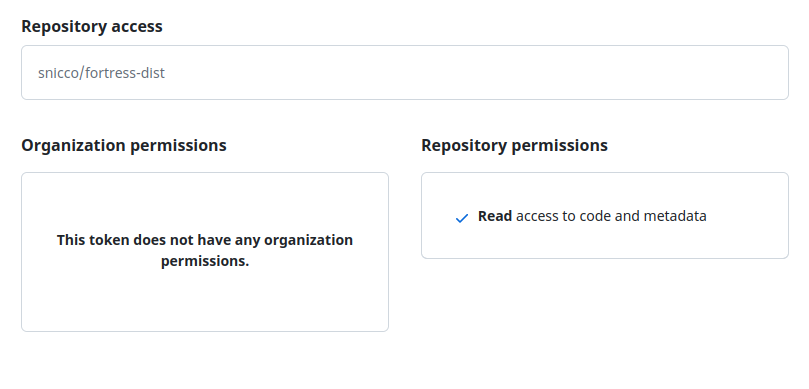

# Fortress production setup

<!-- TOC -->
  * [Overview](#overview)
  * [Versioning](#versioning)
  * [Downloading a Fortress Release](#downloading-a-fortress-release)
    * [Download using the GitHub UI](#download-using-the-github-ui)
    * [GitHub API](#github-api)
      * [Create a GitHub personal access token (PAT)](#create-a-github-personal-access-token-pat)
      * [Download using the GitHub API](#download-using-the-github-api)
    * [Download using Composer](#download-using-composer)
    * [Other download methods](#other-download-methods)
  * [Server setup](#server-setup)
    * [Create a Fortress "home" directory](#create-a-fortress-home-directory)
    * [Create an empty Fortress config file](#create-an-empty-fortress-config-file)
    * [Create Fortress secrets](#create-fortress-secrets)
    * [Create a Fortress loader and activate Fortress](#create-a-fortress-loader-and-activate-fortress)
  * [Optimal file system permissions](#optimal-file-system-permissions)
    * [For Fortress source code](#for-fortress-source-code)
    * [For the Fortress home directory](#for-the-fortress-home-directory)
  * [Other considerations](#other-considerations)
    * [Full-page caching](#full-page-caching)
    * [Log rotation](#log-rotation)
<!-- TOC -->

---

## Overview

This guide provides step-by-step instructions to set up a production-ready installation of Fortress on your WordPress
site. By following these instructions, you will:

1. Download/Upload a Fortress release to your server.
2. Create required Fortress directories.
3. Set optimal file system permissions.
4. Optionally, implement additional considerations for optimal performance and security.

**Requirements for this guide:**

- SSH access to your server.
- Familiarity with basic Linux commands.
- Access to the `snicco/fortress-dist` repository on GitHub.

You can also perform these steps on a local WordPress site by executing the commands in your local terminal instead of
over SSH.

Make sure you have all the [system requirements](01_requirements.md) in place before proceeding.

## Versioning

Fortress strictly follows [semantic versioning (SemVer)](https://semver.org/), ensuring no breaking changes are
introduced in a minor or patch release.

Releases are deployed to the [`snicco/fortress-dist`](https://github.com/snicco/fortress-dist) repository on GitHub.
You should have access to this repository after purchasing a license.

You can download past versions of Fortress, not just the latest release.

## Downloading a Fortress Release

To install Fortress, you need to download a release of the Fortress codebase onto your server.

Fortress supports a wide range of download methods,
from simple ZIP uploads to complex CI/CD workflows with Fortress as a Composer dependency.

Choose the method that best fits your needs:

- [Download using the GitHub UI](#download-using-the-github-ui)
- [Download using the GitHub API](#download-using-the-github-api)
- [Download using Composer](#download-using-composer)
- [Other download methods](#other-download-methods)

### Download using the GitHub UI

🚨 You need to be logged in with a GitHub account that has access to the `snicco/fortress-dist` repository.

1. Go to the [release archive](https://github.com/snicco/fortress-dist/releases).
2. Click on the version that you want to download.
3. Click on `Assets`.
4. Download the zip file named `snicco-fortress-<VERSION>.zip`.<br><br>
   
5. Create a `snicco-fortress/releases` directory inside the `mu-plugins` directory of the WordPress site where you want
   to install Fortress.
   ```shell
   ssh username@your-server-ip 'mkdir -p /path-to-mu-plugins/snicco-fortress/releases'
   ```
    - Replace `username@your-server-ip` with your SSH credentials.
    - Replace `/path-to-mu-plugins` with the full path to your WordPress site's must-use plugins directory.

   <br>For example:
    ```shell
    ssh snicco@165.54.171.11 'mkdir -p /var/www/snicco.io/htdocs/wp-content/mu-plugins/snicco-fortress/releases'
    ```
   or for a Bedrock site:
    ```shell
    ssh snicco@165.54.171.11 'mkdir -p /var/www/snicco.io/web/app/mu-plugins/snicco-fortress/releases'
    ```
6. Upload the ZIP archive from step 4 to the `snicco-fortress/releases` directory, for example, using `scp` or `rsync`.
    ```shell
    scp /path/to/local/snicco-fortress-<VERSION>.zip user@your-server-ip:/path-to-mu-plugins/snicco-fortress/releases
    ```
    - Replace `/path/to/local/snicco-fortress-<VERSION>.zip` with the path to the ZIP archive on your local computer.
    - Replace `user@your-server-ip` with your SSH credentials.
    - Replace `/path-to-mu-plugins` with the full path to your WordPress site's must-use plugins directory.

   <br>For example:
    ```shell
    scp ~/Downloads/snicco-fortress-1.0.0-beta.39.zip snicco@165.54.171.11:/var/www/snicco.io/htdocs/wp-content/mu-plugins/snicco-fortress/releases
   ``` 

   You can also upload the ZIP archive using an SFTP client like FileZilla.
   <br>
   <br>
   Regardless of which method you choose, you should now have a `snicco-fortress-<VERSION>.zip` file inside
   the `/path-to-mu-plugins/snicco-fortress/releases` directory.
   <br>
   <br>
7. SSH into your production server and navigate to the newly created `/path-to-mu-plugins/snicco-fortress/releases`
   directory.
    ```shell
    ssh username@your-server-ip
    cd /path-to-mu-plugins/snicco-fortress/releases
    ```
    - Replace `username@your-server-ip` with your SSH credentials.
    - Replace `/path-to-mu-plugins` with the full path to your WordPress site's must-use plugins directory.

   <br>For example:
    ```shell
    ssh snicco@165.54.171.11
    cd /var/www/snicco.io/htdocs/wp-content/mu-plugins/snicco-fortress/releases
    ```
8. Unzip the Fortress release into a `snicco-fortress/releases/current` directory.<br>
   You can copy and paste the following commands as is:
    ```shell
    # Unzip the release
    unzip snicco-fortress-*.zip
    
    # Remove the zip archive
    rm snicco-fortress-*.zip
    
    # Move the source code to a subdirectory named `current`
    mv snicco-fortress current
    ```
9. Proceed with the [server setup](#server-setup).

### GitHub API

#### Create a GitHub personal access token (PAT)

Unless you manually download a release from the GitHub UI, you need a personal access token (PAT)
with the `Contents: Read` scope on the `snicco/fortress-dist` repository.

- Make sure that you're signed in with an account that has access to  `snicco/fortress-dist` repository.
- Create a new, fine-grained PAT by going
  to [GitHub's personal access token page](https://github.com/settings/personal-access-tokens/new), and
  grant it the `Contents: Read` scope on the `snicco/fortress-dist` repository.<br>
  No other permissions are required.
- Choose a descriptive name for the token, such as "Fortress Download Token."
- Choose a suitable expiration date, depending on your needs.



#### Download using the GitHub API

🚨 Make sure to use the PAT you created in the [previous step](#create-a-github-personal-access-token-pat).

GitHub's REST API contains several endpoints that you can
combine to download any Fortress release.

1. SSH into your production server.
2. Make your PAT available as an environment variable in your terminal.
    ```shell
    export GITHUB_TOKEN=your_personal_access_token_here
    ```
3. Navigate to the `mu-plugins` directory of your WordPress site.
   For example:
   ```shell
   cd /var/www/snicco.io/htdocs/wp-content/mu-plugins
   ```
   or for a Bedrock site:
   ```shell
   cd /var/www/snicco.io/web/app/mu-plugins
   ```    
   Note: If the `mu-plugins` directory does not yet exist inside the `wp-content` directory,
   you can create it by running:
   ```shell
    mkdir -p /path-to-wordpress/wp-content/mu-plugins
    ```
    - Replace `/path-to-wordpress` with the full path to your WordPress site's must-use plugins directory.

4. Create a `snicco-fortress/releases/current` directory inside the `mu-plugins` directory.
     ```shell
     mkdir -p snicco-fortress/releases
     ```
5. Navigate into the directory you just created.
    ```shell
    cd snicco-fortress/releases
    ```
6. Paste the following script into your terminal.<br>
    - The script fetches the download URL of Fortress's latest release form the GitHub API.
    - It downloads the release with `curl`.
    - Unzips the release in the current working directory.
    - Removes the zip archive.
    - Moves the source code to a subdirectory named `current`.
    ```shell
    download_url=$(curl -s \
       -H "Accept: application/vnd.github+json" \
       -H "Authorization: Bearer ${GITHUB_TOKEN}"\
       -H "X-GitHub-Api-Version: 2022-11-28" \
       https://api.github.com/repos/snicco/fortress-dist/releases | jq -r '.[0].assets[0].url')
        
    curl -O -J -L \
       -H "Authorization: Bearer ${GITHUB_TOKEN}"\
       -H "Accept: application/octet-stream" \
       -H "X-GitHub-Api-Version: 2022-11-28" \
       "${download_url}"
        
    unzip snicco-fortress-*.zip
   
    rm snicco-fortress-*.zip
   
    mv snicco-fortress current 
    ```
   Note: The above script is meant for automated deployment workflows. Error handling has been omitted for brevity.
7. You should now see the Fortress codebase inside the `/path-to-mu-plugins/snicco-fortress/releases/current` directory.
    ```console
    $ ls current
    bin  boot  composer.json  config lang  LICENSE.txt  main.php  public  snicco-fortress.php  src  stubs  var  vendor  version-info.php
    ```
8. Proceed with the [server setup](#server-setup).

### Download using Composer

🚨 Make sure to use the PAT you created in the [previous step](#create-a-github-personal-access-token-pat).

You can download Fortress as a [Composer](https://getcomposer.org/) dependency, which is useful
for [Bedrock sites](https://roots.io/bedrock/) or other
Composer/git-based WordPress setups.

1. Configure Composer so that it uses
   your [PAT for GitHub authentication](https://getcomposer.org/doc/articles/authentication-for-private-packages.md#github-oauth).
   ```shell
    composer config github-oauth.github.com your_pat_here
   ```
   If your project depends on other private GitHub repositories besides Fortress,
   you must configure your PAT so that it can access all required repositories, rather than only `snicco/fortress-dist`.

2. Add the `https://github.com/snicco/fortress-dist` repository to the `repositories` section of
   your `composer.json` file.
    ```json
    {
        "repositories": [
            {
                "type": "vcs",
                "url": "https://github.com/snicco/fortress-dist"
            }
        ]
   }
   ```
3. Configure the `extra.installer-paths` option in your `composer.json`, so that Composer downloads Fortress into
   the `path-to-mu-plugins/snicco-fortress/releases/current` directory.
    - For a Bedrock site: `web/app/mu-plugins/snicco-fortress/releases/current`.
    - For a standard WordPress site: `wp-content/mu-plugins/snicco-fortress/releases/current`
   ```json
    {
        "extra": {
            "installer-paths": {
                "path-to-mu-plugins/snicco-fortress/releases/current": ["snicco/fortress"]
            }
        }
    }
    ```
4. Add the `composer/installers` plugin to the `config.allow-plugins` section
   of your `composer.json` file.
     ```json
     {
        "config": {
          "allow-plugins": {
            "composer/installers": true
          }
        }
     }
     ```
5. Your `composer.json` file should now look similar to the following:
    ```json
    {
      "repositories": [
        {
          "type": "vcs",
          "url": "https://github.com/snicco/fortress-dist"
        }
      ],
      "config": {
        "allow-plugins": {
          "composer/installers": true
        }
      },
      "extra": {
        "installer-paths": {
          "path-to-mu-plugins/snicco-fortress/releases/current": [
            "snicco/fortress"
          ]
        }
      }
    }
    ```
6. Install Fortress by running:
    ```shell
    composer require snicco/fortress:^1.0.0-beta
    ```
7. Proceed with the [server setup](#server-setup).

Note: If you're using a GIT-deployed site, you probably should not run `composer install`
directly on your production server, but instead deploy a "complete" WordPress site
from your CI/CD pipeline.
This workflow works perfectly fine with Fortress as a composer dependency.
You only need to make sure that you perform the [server setup](#server-setup) **once**
before deploying Fortress the first time.

### Other download methods

As far as Fortress is concerned, you
can use any method you prefer to get a Fortress release onto your production server.

You could use a custom bash script that downloads releases from your S3 bucket,
or bake the source code into a custom WordPress Docker image.

The only requirement is that, at the end of the day, the Fortress codebase is located in the<br>
`/path-to-mu-plugins/snicco-fortress/releases/current` directory.

## Server setup

You should now have the Fortress codebase in a `/path-to-mu-plugins/snicco-fortress/releases/current` directory
on your server.

At this point, Fortress is **not** yet active; You have a copy of a Fortress release on your server.

This guide now makes the following assumptions:

- Your server hosts multiple (or one) WordPress sites.
- Each WordPress side has its own "root/container" directory.
- The web root of the WordPress files is located inside a subdirectory of the "root/container" directory.

Most modern WordPress hosting stacks use a variation of the above, for example:

- WordPress sites are stored at `/var/www/{domain}`, and the WordPress files are located at `/var/www/{domain}/htdocs`.
- WordPress sites are stored at `/sites/{domain}`, and the WordPress files are located at `/sites/{domain}/public`.

The exact paths are irrelevant; the important part is that the WordPress files are located inside a subdirectory of the
"root."

### Create a Fortress "home" directory

Fortress completely separates code from data.

- The Fortress codebase is located inside the `mu-plugins` directory of your WordPress site.
- All data, such as diagnostic logs, audit logs, secrets, and cached configuration, is stored **outside the WordPress
  web root** in a separate "Fortress home" directory.

Each WordPress site has its own Fortress home directory.

It's important that the Fortress home directory is not inside the WordPress web root for many reasons:

- It ensures that your web server can't accidentally serve these files to the public.
- It (usually) ensures that backup tools or plugins won't include these files in backups.
- It allows you to set more restrictive file permissions on the Fortress home directory that won't be affected by any
  plugin/tool that tries to "fix permissions."

1. SSH into your server and navigate to the **parent directory of your WordPress web root**.
    ```shell
    ssh username@your-server-ip
    cd /path-to-domain-root
    ``` 
    - Replace `username@your-server-ip` with your SSH credentials.
    - Replace `/path-to-domain-root` with the full path to the directory that **contains** your web root.
      This is **not** the directory that contains WordPress files such as `index.php`, but its parent.

   <br>For example, if your WordPress sites are stored at `/var/www/{domain}`:

   ```shell
    ssh snicco@155.54.171.11 
    cd /var/www/snicco.io
    ```
   or, if your WordPress sites are stored at `/sites/{domain}`:
    ```shell
    cd /sites/snicco.io
    ```
2. Create the Fortress Home directory and the required subdirectories.
    ```shell
    mkdir -p fortress
    mkdir -p fortress/var/log
    mkdir -p fortress/var/cache
    ```

### Create an empty Fortress config file

You don't need to know the details of how to configure
every last detail of Fortress yet, but you should create a `config.json` file
inside the `fortress` directory.

```shell
echo '{}' > fortress/config.json
```

### Create Fortress secrets

Fortress requires several cryptographic secrets to encrypt data in the
WordPress database.

Fortress can generate these secrets for you, but it can't magically
determine where to store them securely on your specific server stack.

There are several ways to store the secrets securely, and the pros and cons
of each method are discussed in greater detail in the [secret management](./advanced-setup/secret-managment.md) guide.

For now, store the secrets as PHP constants in a `secrets.php` file
that will be included before loading Fortress.

1. 🚨 Make sure that you are still in the
   same [parent directory of your WordPress web root](#create-a-fortress-home-directory).
    ```console
    $ ls .
    
    fortress other directories
    ```
2. Create new Fortress secrets by running:
    ```shell
    php ./{path-to-current-fortress-release}/bin/prod/generate-secrets.php --php-file > fortress/secrets.php
    ```
   The above PHP script will generate a `secrets.php`
   file inside the `fortress` directory.

   Replace `{path-to-current-fortress-release}` with the path where you downloaded the Fortress release.<br><br>
   For example, if your WordPress files are stored at `/var/www/snicco.io/htdocs`:
    ```shell
    php ./htdocs/wp-content/mu-plugins/snicco-fortress/releases/current/bin/prod/generate-secrets.php --php-file > fortress/secrets.php
    ```
   If your WordPress files are stored at `/sites/snicco.io/public`:
    ```shell
    php ./public/mu-plugins/snicco-fortress/releases/current/bin/prod/generate-secrets.php --php-file > fortress/secrets.php
    ```

3. Verify that the `fortress/secrets.php` file was created successfully. The file contents should look similar to the
   following:
    ```console
   $ cat fortress/secrets.php
   
   <?php

    declare(strict_types=1);

    // Automatically generated Fortress secrets. NEVER EDIT MANUALLY.
    define('SNICCO_FORTRESS_PASSWORD_ENCRYPTION_KEY_HEX', '4051eaa764093a1e0303cff4de3f9166d6ad4a5af0b1f9edfc3ada00430bc8fd');
    define('SNICCO_FORTRESS_DEVICE_ID_AUTHENTICATION_KEY_HEX', '129d1db6abae31346bf02d7a08fde588840a5dafdd8941be93d71f07b611530c');
    define('SNICCO_FORTRESS_TOTP_ENCRYPTION_SECRET_HEX', '04e4cfbfc724b4fe664cfbbd21f38d51166c3669c43a63352dd90461d6a096d6');
    define('SNICCO_FORTRESS_LIBSODIUM_GENERIC_HASH_KEY_HEX', 'deaea8fad7e13c2167d69db32d99579ad70a70d4bb12e7e853fdcd3c0587b9a1');
    define('SNICCO_FORTRESS_LIBSODIUM_GENERIC_ENCRYPTION_KEY_HEX', 'b90c134244815b9e88aa0d02aed72f649baa4f6d259df0728a031f111e62d329');
    ```

### Create a Fortress loader and activate Fortress

Fortress **MUST** be loaded as early as possible in the WordPress
request lifecycle.

To ensure that, Fortress contains a "loader file" that
you have to copy into your WordPress site's `mu-plugins` directory.

After copying the Fortress loader, it is part of **your** code/site.

- Fortress will never modify this file.
- You can customize it to your liking and include it in version control if you're using Git.

You can see the default contents of the loader file [here](../_assets/fortress-loader.php).

1. Navigate to the web root of your WordPress site (the directory that contains the `index.php` file, etc.)
   For example:
   ```shell
   cd /sites/snicco.io/public
   ```
   or
   ```shell
    cd /var/www/snicco.io/htdocs
    ```
   or For Bedrock sites:
   ```shell
    cd /var/www/snicco.io/web/app
    ```
2. Enable the WordPress maintenance mode to prevent any request from being processed during the Fortress activation.
    ```shell
    wp maintenance-mode activate
    ```
3. Navigate to the `mu-plugins` directory of your WordPress site.
    ```shell
    cd wp-content/mu-plugins
    ```
4. Move the Fortress loader to `mu-plugins/0000000000000000000000000000-fortress-loader.php`.
    ```shell
    mv snicco-fortress/releases/current/stubs/fortress-loader.txt 0000000000000000000000000000-fortress-loader.php
    ```
   The leading zeros in the filename ensure that WordPress will load the Fortress loader
   before anything else.
   This is crucial.
5. Fortress's CLI is now available, and you can finish the installation by creating Fortress's database tables
     ```shell
     wp fort setup
     ```
6. Deactivate the WordPress maintenance mode.
    ```shell
    wp maintenance-mode deactivate
    ```
7. Fortress is now installed 🥳!
    - If you try to log in as an administrator, you will be prompted to set up your
      two-factor authentication (2FA) settings.
    - Try logging in with a CLI generated magic link for a user.
      ```shell
       wp fort magic-link create your-username
    
       # => https://domain.com/snicco-fortress/auth/magic-link/challenge/EXqrVmck3eTqeXKIL0YyCXlJbrqvTwOdMjPk4TLXQIlaN1xHmNrqshTY9yqtmm1ZogyYB5V9fCFY?action=magic-login-primary
      ```
8. Proceed with the [optimal file system permissions](#optimal-file-system-permissions) setup to harden your Fortress
   installation.

## Optimal file system permissions

Most modern hosting stacks use a setup where:

- Each WordPress site is owned by a different "system user," commonly named after the domain (e.g. `domaincom`
  for `domain.com`).
- The web server runs as a different user "`webserver`", often named `nginx`, `www-data`, or `apache`.
- The PHP process runs as the same user that owns the WordPress files (e.g. `domaincom`).

The ideal setup of file system permissions would ensure all the following:

### For Fortress source code

- (Only) `domaincom` can `read` the Fortress source code
  at `/path-to-mu-plugins/snicco-fortress`.
- `webserver` can `read/execute` the static assets
  from `/path-to-mu-plugins/snicco-fortress/releases/current/public`.
  (`execute` is likely required to allow traversing/listing directories)
- Anything but the `public` directory is fully `immutable`/`read-only`. There is no reason for it to change unless a
  new Fortress version is deployed.

1. Change the owner of the Fortress source code to `domaincom:domaincom`.

    ```shell
    chown domaincom:domaincom -R /path-to-mu-plugins/snicco-fortress
    ```
    - Replace `/path-to-mu-plugins` with the full path to your WordPress site's must-use plugins directory.
    - Replace `domaincom` with the system user that owns the WordPress files.<br><br>

2. Make the Fortress source code "read-only" for the system user, and unreadable for everybody else.
    ```shell
    find /path-to-mu-plugins/snicco-fortress/releases -type d -exec chmod 500 {} +
    find /path-to-mu-plugins/snicco-fortress/releases -type f -exec chmod 400 {} +
    ```
    - Replace `/path-to-mu-plugins` with the full path to your WordPress site's must-use plugins directory.<br><br>

3. Optional: To make the Fortress source code truly immutable,
   you need to run the installation as `sudo` or `root` and set the immutable flag with `chattr`:
    ```shell
    sudo chattr -R +i /path-to-mu-plugins/snicco-fortress/releases
    ```
    - Replace `/path-to-mu-plugins` with the full path to your WordPress site's must-use plugins directory.<br><br>
    - If you don't have root access to your server, it's okay to skip this step.
    - Setting the immutable flag means that nobody, not even `root` can change the source code, without removing the
      flag first with `chattr -i`.<br><br>
4. Set the Fortress assets (CSS, JS, etc.) read/execute to everyone.
    ```shell
    find /path-to-mu-plugins/snicco-fortress/releases/current/public -type d -exec chmod 555 {} +
    find /path-to-mu-plugins/snicco-fortress/releases/current/public -type f -exec chmod 444 {} +
    ```
    - Replace `/path-to-mu-plugins` with the full path to your WordPress site's must-use plugins directory.
    - Execute permissions are probably required for your webserver to list directory contents.

### For the Fortress home directory

- (Only) `domaincom` can `read/write/execute` in the Fortress home directory at `/path-to-fortress-home`.
- The `secrets.php` file is `read-only/immutable`. Secrets should never be changed unless you explicitly want to rotate
  them. Accidentally changing them could result in data loss.

1. Set the owner of the Fortress home directory to `domaincom:domaincom`.
    ```shell
    chown domaincom:domaincom -R /path-to-fortress-home
    ```
    - Replace `domaincom` with the system user that owns the WordPress files.
    - Replace `/path-to-fortress-home` with the full path to
      your [Fortress home directory](#create-a-fortress-home-directory).<br><br>

   For example:
    ```shell
    chown snicco:snicco -R /var/www/snicco.io/fortress
    ```
   or:
   ```shell
    chown examplecom:examplecom -R /sites/example.com/fortress
    ```
2. Set all directories inside the Fortress home to `700` (read/write/execute)
   ```shell
   chmod -R 700 /path-to-fortress-home
   ```
    - Replace `/path-to-fortress-home` with the full path to
      your [Fortress home directory](#create-a-fortress-home-directory).<br><br>
3. Make Fortress config `read/write` for the system user, and unreadable for everybody else.
    ```shell
    chmod 600 /path-to-fortress-home/config.json
    ```
    - Replace `/path-to-fortress-home` with the full path to
      your [Fortress home directory](#create-a-fortress-home-directory).<br><br>

4. Make the `secrets.php` file `read-only` for the system user, and unreadable for everybody else.
    ```shell
    chmod 400 /path-to-fortress-home/secrets.php
    ```
    - Replace `/path-to-fortress-home` with the full path to
      your [Fortress home directory](#create-a-fortress-home-directory).<br><br>
5. Optional: If you have `sudo`/`root` access to your server, you can set the immutable flag on the `secrets.php` file:
   ```shell
   sudo chattr +i /path-to-fortress-home/secrets.php
   ```
   If you don't have `sudo` or `root` access to your server, you can skip this step.

## Other considerations

### Full-page caching

🚨 If you don't use any full-page caching solution, you can skip this section.

Fortress manages every URL under `domain.com/snicco-fortress/*`
and sets the `Cache-Control: no-store, private` header on these URLs.

`/snicco-fortress/*` URLs should never be cached by any caching solution as they contain per-user data.

If your cache solution respects the `Cache-Control` header, you don't need to do anything.

Otherwise, you need to exclude these URLs from caching in your caching tool.

Example Nginx configuration:

```nginx
if ($request_uri ~* "(/snicco-fortress.*)") {
 # YOUR CACHE EXCLUSION LOGIC GOES HERE.
 set $skip_cache 1;
 set $skip_reason "${skip_reason}-request_uri";
}
```

### Log rotation

Currently, Fortress does not perform log rotation itself.

If you have a high-traffic site, you may want to configure
automatic log rotation for the `fortress/var/log/*.log` files

The below logrotate configuration is a good starting point:

```log
/path-to-fortress-home/var/log/*.log {
  create 0600 domaincom domaincom
  daily
  rotate 7
  missingok
  notifempty
  compress
  sharedscripts
}
```

- Replace `/path-to-fortress-home` with the full path to
  your [Fortress home directory](#create-a-fortress-home-directory).
- Replace `domaincom` with the system user that owns the WordPress files.

For example:

```log
/var/www/snicco.io/fortress/var/log/*.log {
  create 0600 snicco snicco
  daily
  rotate 7
  missingok
  notifempty
  compress
  sharedscripts
}
```

---

Next: [How to update Fortress](03_updates.md)